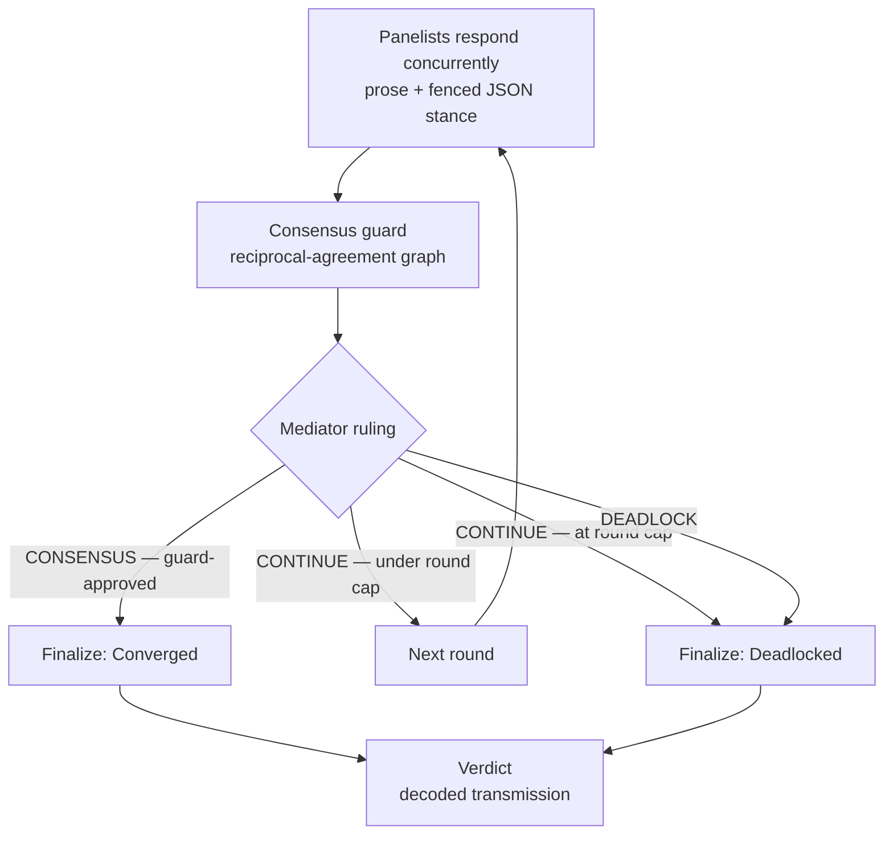

# krunch

> A jury-room deliberation engine for a panel of LLMs.

**krunch** convenes a panel of large language models to argue a hard question over
multiple rounds and deliberate their way to a **verdict** — not a single model's
one-shot take. Each model takes a seat, states its position and confidence,
declares who it agrees with, and a **mediator** rules each round until the panel
either **converges** or **deadlocks**. You watch the whole thing unfold live in a
mission-control terminal: channels streaming, a trace on the oscilloscope, real
token telemetry, everything instrumented and legible under pressure.

It is a native desktop app built with **Tauri 2** (Rust core) and a **Vue 3 +
TypeScript + Tailwind v4** frontend.

- **Version:** 0.1.0
- **License:** MIT
- **Platform:** desktop (macOS primary; Linux/Windows via Tauri)

---

## Table of contents

- [Why krunch](#why-krunch)
- [How a deliberation works](#how-a-deliberation-works)
- [Providers](#providers)
- [Architecture](#architecture)
- [Getting started](#getting-started)
- [Using the app](#using-the-app)
- [Credentials & security](#credentials--security)
- [Data & persistence](#data--persistence)
- [Development](#development)
- [The "Signal" design system](#the-signal-design-system)
- [Scope & roadmap](#scope--roadmap)
- [License](#license)

---

## Why krunch

Asking one model a hard question gives you one model's answer, with all of its
blind spots baked in. krunch instead runs a **structured multi-agent
deliberation**:

- **Diverse panel.** Seat models from different providers, or the same model with
  different personas and system prompts, and let them disagree.
- **Structured, not free-for-all.** Every panelist emits a machine-readable
  *stance* (position, confidence, who it agrees with, open questions) alongside its
  prose. Agreement is computed from structured fields — never guessed from text.
- **A deterministic consensus guard.** The mediator cannot declare consensus
  against the evidence; a pure, testable graph algorithm decides whether the panel
  has actually aligned.
- **Watchable and auditable.** The full transcript — every round, stance, ruling,
  retry, and the final verdict — is persisted to SQLite and exportable as a
  Markdown filing.

---

## How a deliberation works

### Seats

A session is a **roster of seats**:

- **2–6 panelists** — the models that argue.
- **exactly one mediator** — the model that summarizes each round and rules on it.

Each seat carries a provider, base URL, model, system prompt, sampling params,
optional personas, and an opaque credential reference (see
[Credentials & security](#credentials--security)).

### The round loop



1. **Panelists respond concurrently.** Each streams its reasoning as prose, then a
   fenced ` ```json ` **stance** block:

   ```json
   { "v": 1, "stance": "ship the cozy sim", "confidence": 0.82,
     "agree_with": ["seat-2"], "open_questions": ["multiplayer cut?"] }
   ```

   A seat that fails gets **one retry, then abstains** — an abstention is normal
   and does not abort the run.

2. **The consensus guard evaluates the round.** Purely over structured fields, it:
   - builds an **undirected agreement graph from reciprocal `agree_with` edges only**
     (A→B counts only if B→A also holds — one-sided claims are ignored),
   - finds the largest connected cluster, which must cover **≥ `quorum_fraction`**
     of surviving panelists (default **⌈2/3⌉**), and
   - requires **mean survivor confidence ≥ `confidence_floor`** (default **0.6**).

   Stance *prose* is never compared — that would be non-deterministic.

3. **The mediator rules** `CONSENSUS`, `CONTINUE`, or `DEADLOCK`. It is the final
   arbiter, but the guard has veto power: it **cannot ratify a `CONSENSUS`** the
   evidence doesn't support (that ruling is downgraded).

4. **Finalization.** On guard-approved consensus, or on `DEADLOCK` / hitting the
   round cap, a synthesis round produces the verdict.

### Interaction modes

The mode governs *when* the mediator surfaces its questions to you. The parallel
round itself is always atomic regardless of mode.

| Mode | Behavior |
|------|----------|
| **Autonomous** | Never pauses. Every suppressed question becomes a recorded assumption. |
| **Batched** | The mediator decides at round boundaries whether to interrupt for input. |
| **Interactive** | Pauses at every round boundary that has open questions. |

### Session lifecycle

`Configuring → Starting → Running` (⇄ `AwaitingUser`) `→ Finalizing →` a terminal
state:

- **Converged** / **Deadlocked** — a verdict was produced (success).
- **Halted** — too few panelists survived to continue.
- **MediatorError** — the mediator failed or returned an unusable ruling.
- **Interrupted** — crash recovery marked an unfinished session.
- **Abandoned** — you ended the run.

The state machine (`transition(state, event)`) is pure, total, and independently
tested — it is the single source of truth for what may follow what.

### Configuration bounds

| Field | Bound |
|-------|-------|
| Panelists | 2–6 |
| Mediator | exactly 1 |
| `max_rounds` | 1–64 |
| Problem statement | ≤ 20,000 chars |
| `quorum_fraction` | in (0, 1] |
| `confidence_floor` | in [0, 1] |

Validation runs **before any provider task launches** and reports *every* problem
at once, so an invalid roster never reaches spend.

---

## Providers

Every provider sits behind one `Agent` trait, so seats mix freely in a single
panel.

| Provider | Auth | Notes |
|----------|------|-------|
| **Anthropic** | API key | Messages API over HTTP. |
| **OpenAI-compatible** | API key, or key-free on loopback | Any `/chat/completions` endpoint — OpenAI, local Ollama / LM Studio, etc. |
| **Claude CLI** | your subscription | Drives the local `claude` CLI; no API key. |
| **Codex CLI** | your subscription | Drives the local `codex` CLI; no API key. |
| **Demo** | none | Built-in offline agent — no key, no network. Great for trying the flow. |

The CLI agents run **clean-room**: they skip your personal setup (hooks,
`CLAUDE.md`/`AGENTS.md`, plugins, skills, MCP, session persistence) so a panelist's
prompt isn't polluted by tens of thousands of tokens of your own context, and they
are asked for realtime JSONL output so seats stream live rather than dumping the
whole answer at the end.

---

## Architecture

A Cargo workspace of focused Rust crates under a Tauri shell, with a Vue frontend.

```
krunch/
├── crates/
│   ├── krunch-core/       # Pure domain logic — no HTTP, no SQLite, no Tauri
│   │                      #   state machine · config + validation · wire schemas
│   │                      #   fenced-JSON parsing · consensus guard
│   ├── krunch-providers/  # Provider adapters behind one Agent trait
│   │                      #   Anthropic · OpenAI-compatible · Claude/Codex CLI · Demo
│   ├── krunch-store/      # SQLite persistence (single-writer)
│   │                      #   sessions → rounds → attempts → chunks, + crash recovery
│   └── krunch-engine/     # The orchestrator — Tauri-free, fully mockable
│                          #   concurrent rounds · retries · consensus · finalization
├── src-tauri/             # The desktop app crate (`krunch`)
│                          #   Tauri commands · keychain credentials · endpoint safety · export
├── src/                   # Vue 3 + TS frontend
│   ├── screens/           #   Setup · Room · Verdict
│   ├── components/        #   SeatCard, MediatorPanel, ConvergenceStrip, OscilloscopeSync,
│   │                      #   CommandPalette, EventLogRail, HistoryDialog, ui/ (shadcn-vue)
│   ├── stores/            #   Pinia: deliberation + settings
│   └── lib/               #   typed IPC (api.ts), types, telemetry, shortcuts, preview seeds
└── docs/                  # Design specs & implementation plans
```

**Dependency direction:** `core` ← `providers`/`store` ← `engine` ← `src-tauri`.
The domain crate knows nothing of the outside world; the orchestrator injects
agents, the user gate, and the event sink as traits so every path is testable with
mocks.

**Frontend stack:** Vue 3.5, TypeScript, Tailwind v4, Pinia, [reka-ui] /
shadcn-vue components, Vite 6. The Rust core streams lifecycle + token events to
the UI over a single Tauri event channel; `src/lib/api.ts` wraps every command in a
typed helper.

---

## Getting started

### Prerequisites

- **Rust** (stable toolchain, edition 2021) — install via [rustup](https://rustup.rs/).
- **Node.js ≥ 20** and **npm**.
- **Tauri v2 platform dependencies** — follow the
  [Tauri prerequisites guide](https://v2.tauri.app/start/prerequisites/) for your
  OS (on macOS: Xcode Command Line Tools).

### Install

```bash
git clone <this-repo> krunch
cd krunch
npm install
```

Cargo dependencies are fetched automatically on the first build.

### Run the app (development)

```bash
npm run tauri dev
```

This starts the Vite dev server on `http://localhost:1420`, compiles the Rust core,
and opens the desktop window (default 1280×840, min 940×640) with hot-reload for the
frontend.

> **No keys? No problem.** Load the built-in **Demo** panel from the setup screen
> to watch a full deliberation run end-to-end with zero configuration.

### Build a release bundle

```bash
npm run tauri build
```

Produces native installers/bundles for your platform under `src-tauri/target`.

---

## Using the app

1. **Set up the panel.** On the setup screen, define the problem, pick an
   interaction mode and round cap, and add seats (provider, model, system prompt,
   persona, sampling). Save rosters as **presets** for reuse. Preflight validation
   flags every issue before you can convene.
2. **Convene.** Watch the **Room**: each seat is a channel streaming its reasoning
   live, with per-seat token telemetry. The **oscilloscope** and **convergence
   strip** track alignment in real time from backend truth (cluster fraction + mean
   confidence), snapping to **SIGNAL LOCK** on consensus and jittering red on
   deadlock. The **event log rail** records lifecycle events; in interactive/batched
   modes the mediator's questions surface here for you to answer.
3. **Read the verdict.** The ruling resolves as a sealed "decoded transmission."
   Export the full session as a Markdown filing, or dump it to `~/Downloads`.
4. **Revisit.** Browse past sessions in the **history** dialog and re-open any run
   read-only, or clone a past setup as the starting point for a new one.

krunch is **keyboard-native**: press `⌘K` / `Ctrl-K` for the command palette
(convene, add seat, export, focus a seat, help). An effects toggle (**Off /
Ambient / Max**) tunes the ambient motion; everything also respects
`prefers-reduced-motion`.

---

## Credentials & security

- **Keys never touch the database.** API keys live in the **OS keychain** (via the
  `keyring` crate, service `krunch`), referenced only by an opaque
  `credential_ref`. The audit snapshot stores the reference, never the secret.
- **Endpoint safety.** Before any key is attached to a request, the endpoint origin
  is validated: **HTTPS is required**, with an explicit **loopback `http` opt-in**
  for local servers (Ollama, LM Studio). Cross-origin redirects are disabled at the
  HTTP layer.
- **Locked-down webview.** A strict Content-Security-Policy confines the frontend to
  its own assets and the Tauri IPC bridge.

---

## Data & persistence

- Sessions are persisted to a bundled **SQLite** database in the app's data
  directory (resolved via Tauri's `app_data_dir`), on one relational spine:
  `sessions → rounds → attempts → chunks`, plus `seats`, `stances`, `rulings`,
  `user_qa`, and `error_records`. Writes go through a **single writer**; the schema
  migrates idempotently and supports **crash recovery** of interrupted runs.
- **Token/cost telemetry is transient (v1).** Per-seat and session token counts are
  UI-only and reset on reload; cost estimates are shown only for known
  OpenAI/Anthropic models and never fabricated for custom endpoints, CLI, or demo
  seats. A persisted usage read-model is a deferred follow-up.

---

## Development

### Project layout

See [Architecture](#architecture). The pure domain lives in `crates/krunch-core`;
side effects (HTTP, SQLite, keychain, Tauri) live in `krunch-providers`,
`krunch-store`, and `src-tauri`; orchestration lives in `krunch-engine`.

### Rust

```bash
cargo test            # run the workspace test suite
cargo build           # build all crates
cargo clippy          # lint
cargo fmt             # format
```

The engine is deliberately Tauri-free and driven by trait-injected mock agents, so
the full deliberation flow — concurrent rounds, retries, the consensus guard,
finalization — is exercised in unit tests without a network or a window.

### Frontend

```bash
npm run dev           # Vite dev server only (frontend, no Rust shell)
npm run build         # type-check (vue-tsc) + production build
```

Running the plain Vite server is handy for iterating on UI in a browser without
launching the desktop shell.

### Preview seeds (design without a backend)

The store can be seeded with representative data so the Room / Verdict screens
render — and can be screenshotted — with no backend. Start `npm run dev` and append
a query param:

| URL | What it shows |
|-----|---------------|
| `?preview=room` | A live-looking room mid-deliberation |
| `?preview=verdict` | A converged verdict |
| `?preview=deadlock` | A deadlocked outcome |
| `?preview=halted` | A halted session |
| `?preview=awaiting` | The mediator awaiting user input |
| `?preview=stream` | A full scripted deliberation replayed with realistic timing |

Preview seeding is dev-only and a no-op in production builds.

---

## The "Signal" design system

krunch's UI is a **deliberation ops terminal** — *live, monitored, decisive*. Full
details live in [`.impeccable.md`](.impeccable.md); the essentials:

- **Palette.** A pure-black void, surfaces lifted just enough to read with a faint
  green cast, and a single neon-green **signal** accent. State rides the same hue
  family: bright green as the panel converges, dim signal while it runs, neon red at
  deadlock.
- **Typography.** The **Monaspace** family throughout — Departure Mono (pixel) for
  the wordmark and verdict, Neon for UI chrome, Krypton for telemetry, Argon for
  streamed prose, Xenon for the sealed record.
- **Signature moment — Oscilloscope Sync.** Each panelist is a waveform channel;
  amplitude tracks confidence and streaming seats jitter. As convergence climbs,
  channels phase-lock into one bright-green trace; on deadlock they desync into red
  noise — driven entirely by live store data, not decoration.
- **Graceful degradation.** Every effect is gated on a continuous intensity
  (Off / Ambient / Max), collapses further under `prefers-reduced-motion`, and
  auto-reduces under sustained frame-time pressure. Legibility across long
  multi-round sessions comes first.

---

## Scope & roadmap

**In scope today:** the full deliberation engine, five providers, persisted session
history, the Signal cockpit UI, real per-seat token telemetry, and Markdown export.

**Deferred / out of scope for v1:**

- Persisted token/cost read-model (telemetry is transient today).
- Light theme / theming system (the terminal is dark-only by design).
- Mobile / responsive layouts (this is a desktop power tool).
- Session replay/scrub and shareable seat presets.
- New providers or backend features unrelated to token-usage telemetry.

---

## License

[MIT](LICENSE) © kyle.dougan

[reka-ui]: https://reka-ui.com/
